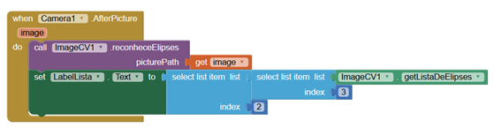

# Como a extensão foi codificada
---

A extensão ImageCV está sendo desenvolvida com base na biblioteca de visão computacional [BoofCV](https://boofcv.org/index.php?title=Main_Page), escolhida por não utilizar bibliotecas “nativas” codificadas em linguagem diferente de Java,
ser Open Source, estar em constante atualização, e ainda por ter suporte ao Android.

As seções deste documento são:
1. [Pacotes do BoofCV](#pacotes-do-boofcv)
2. [Funcionamento da extensão](#funcionamento-da-extensão)
    1. [Funcionalidade básica](#funcionalidade-básica)
    2. [Funções relacionadas à visão computacional](#funções-relacionadas-à-visão-computacional)

## Pacotes do BoofCV

A biblioteca BoofCV (Atualmente na versão 0.36) é disponibilizada de duas formas: uma delas apresenta as dependências colocadas de forma a serem
facilmente adicionadas pelas IDE’s por meio de comandos. Já a outra é através de arquivos jar, que devido à plataforma para o qual a extensão é
desenvolvida (App Inventor), é a forma utilizada para aplicação da biblioteca na extensão.

A versão da biblioteca selecionada é a 0.27 ([Baixe aqui](https://sourceforge.net/projects/boofcv/files/v0.27/boofcv-v0.27libs.zip/download)),
podendo ainda ser modificada para a 0.28. As versões mais recentes não são utilizadas devido à incompatibilidade do App Inventor com a biblioteca,
o primeiro tendo suporte para o Java 7, já a segunda desenvolvida para o Java 8-11 a partir da versão 0.29.

As [demais versões](https://boofcv.org/index.php?title=Download) estão disponíveis no site da própria biblioteca.

Os pacotes utilizados pela extensão atualmente são:

- boofcv-android.jar
- boofcv-ip.jar
- ddogleg.jar
- georegression.jar
- boofcv-feature.jar
- ejml-core.jar
- ejml-ddense.jar
- ejml-fdense.jar
- ejml-simple.jar

### Configuração dos pacotes

Após serem baixados, os pacotes que serão utilizados devem ser colocados na pasta `appinventor\lib`.
Estes podem ser colocados em uma subpasta com nome a ser escolhido.

Para que seja compilado devidamente, o arquivo [build.xml](../build.xml), localizado dentro da pasta `appinventor\components`, deve ser modificado.

A seguinte formatação deve ser colocada na seção CopyComponentLibraries target
(Há um comentário com uma indicação: \<!-- Add extension libraries here \-->) para cada pacote adicionado à pasta lib que será utilizado:

~~~
<copy toFile=”${public.deps.dir}/nomeSimplificadoDoArquivoJar.jar”
file=”${lib.dir}/SubpastaDaBibliotecaNoLib/nomeDoArquivoJar.jar” />
~~~

Se estiver correto, após a compilação os pacotes serão copiados da pasta lib para a pasta `appinventor\build\components\deps`.

Por último, é necessário alterar o arquivo da classe da extensão de forma a informar quais bibliotecas serão utilizadas
durante a extensão, etapa na qual já está feita para os arquivos jar que são atualmente utilizados.
Debaixo dos detalhes da extensão, a seguinte formatação deve estar colocada:

~~~
@UsesLibraries(libraries = "library1.jar," +  “library2.jar,” + … + “libraryN.jar”)
~~~

## Funcionamento da extensão

### Funcionalidade básica

#### Métodos acessores

Logo ao início está a parte do código que disponibiliza para o usuário as informações geradas pela extensão,
possibilitando também que o mesmo possa modificar algumas delas.

Por exemplo:

~~~java
    /**
     * Retorna imagem alterada pela extensao
     */
    @SimpleProperty(category = PropertyCategory.BEHAVIOR)
    public String getAltImagePath() {
        return altImagePath;
    }
~~~

#### Imagem após ser fotografada

O método converteDrawableToBitmap trata a imagem assim que a foto é tirada pelo componente da câmera do App Inventor e seu
caminho se torna disponível para uso.

O caminho da imagem é recebido e um drawable é gerado a partir disto, utilizando uma classe do próprio App Inventor
(MediaUtil) que trata as variantes de uma imagem. Em seguida um bitmap em escala é criado, evitando possíveis problemas
gerados pelas imagens rotacionadas etc. e retornado.

A conversão de drawable para bitmap ocorre para que os processos envolvendo visão computacional sejam aplicados.

#### Salvando imagem alterada pela extensão

No método salvaAltImage o bitmap que passou por algum processo e foi alterado é comprimido, convertido para uma jpeg e
salvo na galeria do celular por meio de um objeto file.

Por fim, nesse mesmo método, o caminho da imagem alterada é salvo para posterior uso, como exibição desta no aplicativo,
entre outros.

Todas as imagens que passam por processos da extensão são salvas no mesmo caminho: pictures/ImageCV

## Funções relacionadas à visão computacional

Note que muitas classes da biblioteca BoofCV utilizam o tipo BufferedImage para processar as imagens, porém esta classe não
é suportada pelo Android. Alternativamente, a biblioteca apresenta classes que possibilitam a conversão de bitmap para
tipos de imagens em que a mesma trabalha. Estas classes estão presentes no pacote jar boofcv-android-0.27.

### Marcando cores

Como uma forma de ampliar as informações adquiridas através de uma imagem, é possível a marcação de determinadas cores com o
método stepHSV. Neste método a imagem é convertida de RGB para o HSV por meio do BoofCV. Este formato possibilita uma maior
abrangência na captura de cores e uma manipulação das informações mais facilmente. O usuário especifica a cor a ser
identificada (em formato HSV). Se esta cor for encontrada, os pixels relacionados têm suas cores alteradas para o preto
(Cor no qual o reconhecimento de figuras geométricas também se torna possível) e o resto da imagem é alterada para a cor branca.

Esta função pode ser chamada diversas vezes para marcar diversas cores, não sendo assim necessário especificar uma cor
que estaria precisamente na imagem.

### Reconhecimento de elipses

O reconhecimento de elipses ocorre através do método reconheceElipses. Este pode ser feito de duas formas, utilizando do
reconhecimento de cores em conjunto ou apenas com o método citado. Se há elipses de outras cores que não a preta que devem
ser também analisadas, é recomendado que o reconhecimento de cores seja utilizado em conjunto para uma melhor análise.

Se agindo em conjunto com o reconhecimento de cores, é possível saber quais as cores primárias mais próximas em cada elipse
encontrada e ainda, encontrar apenas elipses de uma determinada cor.

Além disso, outras informações, como as coordenadas do centro da elipse e o seu perímetro aproximado, são fornecidas.

### Reconhecimento de polígonos

O reconhecimento de polígonos é feito através dos métodos: reconhecePoligonos, processaPoligonos, renderPolygon.
Este reconhecimento atua da mesma forma que o de elipses, podendo ser utilizado em conjunto com o reconhecimento de cores
também. Tanto polígonos convexos como côncavos podem ser analisados. A análise pode ainda ser limitada para polígonos com
um certo número de vértices ou ainda por uma determinada cor, ambos podendo ser especificados pelo usuário.

Além da informação da cor de cada polígono encontrado, também são fornecidas as coordenadas dos vértices dos polígonos.

### Disponibilização das informações

As informações que passam pelo reconhecimento de figuras geométricas são disponibilizas por meio de uma lista de listas que
pode ser acessada como uma lista padrão do App Inventor.

As elipses estão contidas em uma lista que possui listas com informações na seguinte ordem: coordenada x do centro,
coordenada y do centro, cor da elipse, perímetro da elipse.

 Já os polígonos estão contidos em uma lista que possui listas com informações na seguinte ordem: cor do polígono,
 coordenada x do vértice 1, coordenada y do vértice 1, coordenada x do vértice 2, coordenada y do vértice 2...

 As listas podem ser acessada e usadas de diversas formas, como por exemplo:
 ListaDeElipses[3].cElipse[2] - Acessando o Cy da Elipse 3 (As iterações do AppInventor começam em 1)

Em programação por blocos, isso seria o equivalente a:

 Para conter essas informações foi utilizado a lista primitiva do App Inventor: **YailList**.
 O código-fonte desta está no caminho:
 `\appinventor-sources\appinventor\components\src\com\google\appinventor\components\runtime\util\YailList.java`

 Além disso, o número de elipses e de polígonos encontrados estão disponíveis por meio das variáveis `nElipses` e  
 `nPolígonos`.
