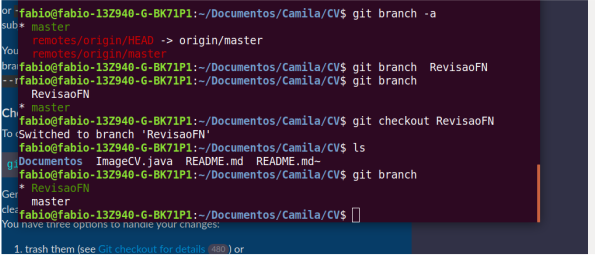
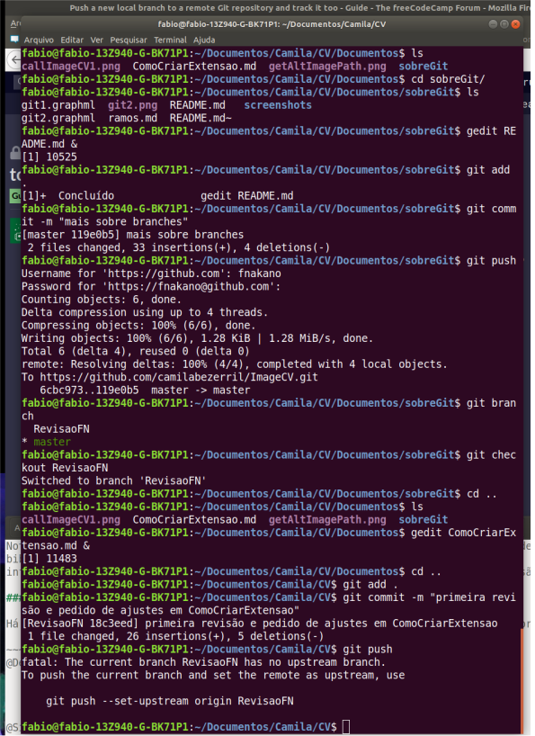
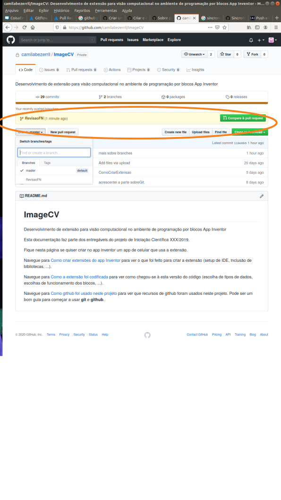
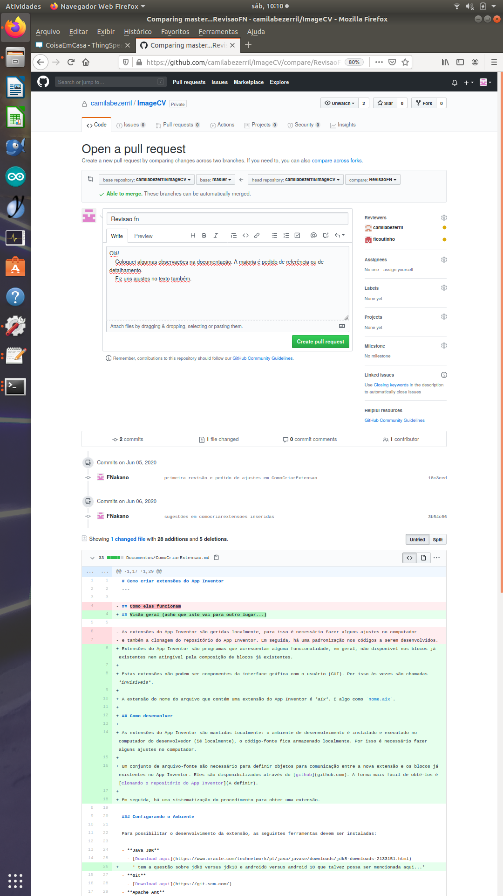
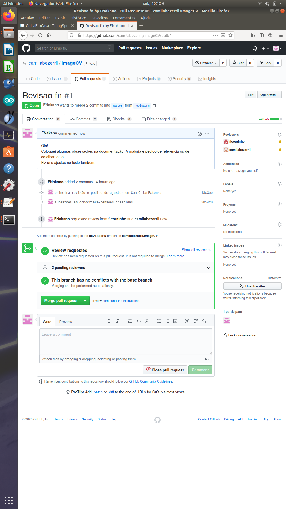

# Ramos (Branches)

## Situação

Vários desenvolvedores, às vezes trabalhando em arquivos separados, às vezes no mesmo arquivo, às vezes um revisando o trabalho do outro, simultaneamente ou não, com o repositório remoto em comum (github).

Desenvolvedores são pessoas e, como tal, importam-se com o resultado do seu trabalho - seja um objeto ou um documento. Em geral, ao menos enquanto estão envolvidas intensamente com o objeto em questão, se surpreendem negativamente quando outra pessoa também faz modificações no mesmo objeto **sem avisar antes**. Git e github podem ser usados para evitar surpresas.

(nota: A surpresa pode não ocorrer, ou ser boa, ou ser bem assimilada, caso as pessoas do grupo já se conheçam, ou têm um acordo prévio, ou têm temperamentos específicos)

A fim de evitar surpresas, o outro desenvolvedor pode adotar o seguinte fluxo de trabalho:

1. criar uma cópia (novo ramo) do objeto original, 
2. fazer os ajustes que achar melhor na sua cópia,
3. **avisar os colegas que tem uma nova versão do objeto**, 
4. discutir o que for necessário e 
5. ele, ou outro, fundir a versão original com a nova versão.

Uma parte das funcionalidades necessárias para isto são fornecidas pelo git, outras pelo github.

## o que é um ramo?

É uma versão do objeto. Pode ser uma cópia local, pode ter sofrido alguma modificação local. 

Num primeiro momento passa despercebido, mas a cópia no repositório remoto e a cópia local são, cada uma, um ramo (preciso confirmar isso, consultando a documentação do git).

Acredito que esses dois ramos (remoto e local), cada desenvolvedor com um ramo local somado a um grupo bem entrosado (um time), dê conta de muitos casos de desenvolvimento colaborativo. Algo como:

1. o grupo se comunica por algum app e combina o que fazer;
2. alguém cria o repositório remoto contendo algum boneco (mock-up, mocapi) do objeto;
3. todos clonam o repositório remoto em seus computadores locais;
4. a cada incremento que alguém quiser compartilhar ele avisa os outros pelo app;
5. discute-se o que for necessário e
6. o autor do incremento funde com a cópia remota, resolvendo os conflitos que ocorrerem.

Este fluxo de trabalho pode funcionar (nunca tentei), mas não permite gerenciar diferentes versões no mesmo local. Por exemplo quando, no mesmo local, alguém trabalha na versão de produção e na próxima versão e precisa trocar de uma para outra, seja para usar a versão de produção, seja para corrigir algo na versão de produção e depois voltar para a versão de desenvolvimento. Ou quando a equipe é grande e há fusões intermediárias,...

### Criar novo ramo

Partindo do pressuposto que você está no diretório local que contém o .git e que clonou o ramo master, o comando *git branch* lista ramos. No meu caso:

```
fabio@fabio-13Z940-G-BK71P1:~/Documentos/Camila/CV$ git branch -a
* master
  remotes/origin/HEAD -> origin/master
  remotes/origin/master
```
Vale notar que existe um ramo *master*, local e um ramo *master* remoto. O ramo em que estou é assinalado por um asterisco.

Com o requisito de partir de um ramo sincronizado (fiz *add, commit e push* ), o comando ```git branch <nome>``` cria **localmente** um novo ramo de nome *<nome>*. Com este comando, ele é criado sincronizado com o ramo em que se está, mas ainda não se mudou para ele, como é possível notar abaixo. Para mudar para o ramo criado, usa-se ```git checkout <nome>```.


```
fabio@fabio-13Z940-G-BK71P1:~/Documentos/Camila/CV$ git branch  RevisaoFN
fabio@fabio-13Z940-G-BK71P1:~/Documentos/Camila/CV$ git branch
  RevisaoFN
* master
fabio@fabio-13Z940-G-BK71P1:~/Documentos/Camila/CV$ git checkout RevisaoFN 
Switched to branch 'RevisaoFN'
fabio@fabio-13Z940-G-BK71P1:~/Documentos/Camila/CV$ ls
Documentos  ImageCV.java  README.md  README.md~
fabio@fabio-13Z940-G-BK71P1:~/Documentos/Camila/CV$ git branch
* RevisaoFN
  master
fabio@fabio-13Z940-G-BK71P1:~/Documentos/Camila/CV$ 
```



(nota: escrevi e salvei este conteúdo com *RevisaoFN* como ramo ativo. Mas este arquivo deveria ser atualizado direto no master pois só eu edito este arquivo. Isto quer dizer que salvei o arquivo num ramo diferente do que eu queria. Como não atualizei, se eu quiser mudar de ramo agora usando *git checkout ...* serei impedido. Posso comitar neste ramo, mas quando eu fizer *pull request* deste ramo, obrigarei meus colaboradores a revisar este arquivo, o que não é necessário. Jogar fora as alterações *thrashing* não é o que eu quero. A solução é *stash*: *git stash*, troca de ramo, *git stash apply*, conforme [sugestão](https://blog.cedrotech.com/git-o-minimo-que-voce-precisa-saber-para-trabalhar-em-equipe-parte-2/) )

A dupla de comandos 

```
git branch <nome>
git checkout <nome>

```

pode ser substituída por
```
git checkout -b <nome>
```

Para sincronizar (ou monitorar, ou track) o novo ramo, ativar o ramo (usando *checkout*) e usar o comando *git push*:

Algumas explicações interessantes estão em [freecodecamp](https://www.freecodecamp.org/forum/t/push-a-new-local-branch-to-a-remote-git-repository-and-track-it-too/13222)

## Fazer ajustes

Fiz sugestões sobre um documento de um colaborador no branch que criei - recebi uma mensagem de erro e uma sugestão.

```
fabio@fabio-13Z940-G-BK71P1:~/Documentos/Camila/CV/Documentos$ gedit ComoCriarExtensao.md &
[1] 11483
fabio@fabio-13Z940-G-BK71P1:~/Documentos/Camila/CV/Documentos$ cd ..
fabio@fabio-13Z940-G-BK71P1:~/Documentos/Camila/CV$ git add .
fabio@fabio-13Z940-G-BK71P1:~/Documentos/Camila/CV$ git commit -m "primeira revisão e pedido de ajustes em ComoCriarExtensao"
[RevisaoFN 18c3eed] primeira revisão e pedido de ajustes em ComoCriarExtensao
 1 file changed, 26 insertions(+), 5 deletions(-)
fabio@fabio-13Z940-G-BK71P1:~/Documentos/Camila/CV$ git push
fatal: The current branch RevisaoFN has no upstream branch.
To push the current branch and set the remote as upstream, use

    git push --set-upstream origin RevisaoFN

fabio@fabio-13Z940-G-BK71P1:~/Documentos/Camila/CV$ 
```



Isso equivale ao que está no freecodecamp, então mais um ponto para o git.

```
fabio@fabio-13Z940-G-BK71P1:~/Documentos/Camila/CV$ git push --set-upstream origin RevisaoFN 
Username for 'https://github.com': fnakano
Password for 'https://fnakano@github.com': 
Counting objects: 4, done.
Delta compression using up to 4 threads.
Compressing objects: 100% (4/4), done.
Writing objects: 100% (4/4), 1.30 KiB | 1.30 MiB/s, done.
Total 4 (delta 2), reused 0 (delta 0)
remote: Resolving deltas: 100% (2/2), completed with 2 local objects.
remote: 
remote: Create a pull request for 'RevisaoFN' on GitHub by visiting:
remote:      https://github.com/camilabezerril/ImageCV/pull/new/RevisaoFN
remote: 
To https://github.com/camilabezerril/ImageCV.git
 * [new branch]      RevisaoFN -> RevisaoFN
Branch 'RevisaoFN' set up to track remote branch 'RevisaoFN' from 'origin'.
fabio@fabio-13Z940-G-BK71P1:~/Documentos/Camila/CV$ 
```

Depois que fiz isso o novo branch apareceu no repositório do projeto:



Lembre-se do botão "Compare & pull request"...

## Avisar os colegas

Para avisar os colegas que você tem uma versão e quer fundir com outra (no caso com o ramo master), faz-se um *pull request* ou ***PR***. Este é um recurso dos ambientes colaborativos, como github e bitbucket ([pesquisei um pouco sobre as ferramentas e empresas.](versionamento.md))

Usei a interface web do github, clicando em *Compare & Pull Request*. Não sei se tem jeito de fazer isso localmente em linha de comando. Apareceu a tela abaixo:



Importante que as diferenças são marcadas e apresentadas. Acho que dá para fazer isso com *git show*, mas não testei.

Preenchi a mensagem, acrescentei pessoas para a revisão (na caixa *reviewers*, na lateral direita) e enviei o PR. No histórico aparece:



(**nota**: comecei a escrever este trecho umas 12:20 do dia 06-06-2020. 

Enquanto estava escrevendo, lembrei de entrar na pasta checar em que ramo eu estava (com *git branch*) vi que estava no ramo de revisão, então troquei para o ramo master ( *git checkout master*) 

```
fabio@fabio-13Z940-G-BK71P1:~/Documentos/Camila/CV$ git branch
* RevisaoFN
  master
fabio@fabio-13Z940-G-BK71P1:~/Documentos/Camila/CV$ git checkout master
Switched to branch 'master'
Your branch is up to date with 'origin/master'.
```
notei que umas imagens tinham *timestamps* de 12:36 - fiquei intrigado pois não fui eu... acho que entendi: Coloquei os arquivos ontem, mas não chequei se os links estavam certos - eu erro muito os nomes dos links. Algum colega tentou navegar, achou o link quebrado, consertou e atualizou o *remote-master*, aí eu fiz checkout e peguei a versão atualizada!

fiz um push e pedi o log...

... parece que não é o que pensei... usei *git log* e vi:

```
commit f4b28ef2e10d810a001669d95adaf867d77b00c9 (HEAD -> master, origin/master, origin/HEAD)
Author: FNakano <fnakano1970@gmail.com>
Date:   Sat Jun 6 13:10:20 2020 -0300

    acrescentei informação sobre pull request

commit 08728977b8d3d58f0addc61168d209dddf86e2a2
Author: FNakano <fnakano1970@gmail.com>
Date:   Fri Jun 5 21:12:16 2020 -0300

    atualização do sobreGit para a parte de Fazer Ajustes em documentos de colaboradores
```

)
 
## Discutir

## Fundir versões

Neste momento as possibilidades se multiplicam: pode haver vários PRs para fundir, o ramo master pode ter avançado antes de alguém atender o PR, pode ocorrer um PR em um ramo que tem um PR pendente, ... aqui vamos no mais simples primeiro: foi PR único que será fundido com o master mais recente.


É possível atribuir a tarefa de fundir versões a outros colaboradores. Por simplicidade, digamos que quem fez o PR é quem vai fundir.

O jeito mais fácil, que é suficiente quando as consequências de erros são pequenas, ou para equipes pequenas, ou para projetos com alta localidade (cada desenvolvedor dificilmente modifica arquivos de outro, consequentemente ocorrem poucos conflitos), é fundir diretamente no master do repositório remoto usando as ferramentas web do repositório.

A questão que surge daí é que pode ser necessário, além de ser uma boa idéia, testar o funcionamento da versão fundida **antes** de compartilhá-la através do repositório remoto.

Como quem fez o PR é quem vai fundir as versões, ambas estão no computador local. Neste contexto, fundir é.... (a escrever)


 
https://help.github.com/pt/github/collaborating-with-issues-and-pull-requests/checking-out-pull-requests-locally
https://gist.github.com/adam-p/15413fabef6cffecd897
https://confluence.atlassian.com/bbkb/how-to-locally-fetch-and-checkout-a-pull-request-724402529.html
https://www.atlassian.com/git/articles/pull-request-proficiency-fetching-abilities-unlocked


### O que fazer quando um pull request fica ultrapassado?

De semana passada para esta, o colaborador recebeu o pull request, trocamos mensagens, ele resolveu as solicitações e fez *push* diretamente no master. Está tudo atendido, o pull request não faz sentido e o merge dos branches, assunto do pull request, já não é mais necessario. O que fazer?

O github tem o recurso de deletar um pull request.

https://help.github.com/pt/github/collaborating-with-issues-and-pull-requests/closing-a-pull-request

## Outros fluxos de trabalho


https://gist.github.com/blackfalcon/8428401
https://www.atlassian.com/git/tutorials/comparing-workflows/gitflow-workflow
https://www.atlassian.com/git/tutorials/comparing-workflows#!workflow-gitflow
https://www.atlassian.com/git/tutorials/comparing-workflows/feature-branch-workflow


