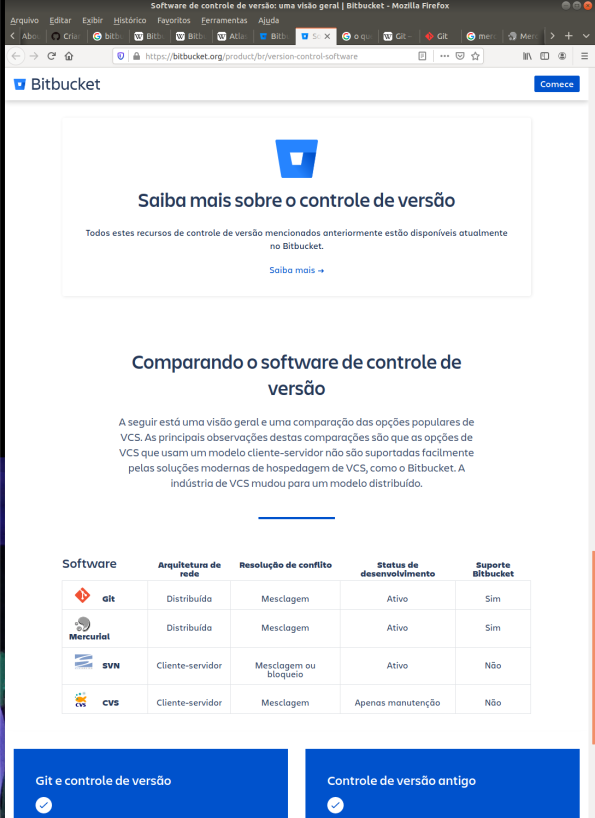

Ferramentas de versionamento existem desde o CVS, talvez antes.

Em 2008 foram criados Bitbucket [wikipedia](https://en.wikipedia.org/wiki/Bitbucket) e GitHub [wikipedia](https://pt.wikipedia.org/wiki/GitHub).

Bitbucket é um produto da Atlassian - uma empresa australiana de desenvolvimento de software para empresas [wikipedia](https://en.wikipedia.org/wiki/Atlassian).

GitHub é produto de empresa de mesmo nome que foi comprada pela Microsoft em 2018 [wikipedia](https://pt.wikipedia.org/wiki/GitHub)

Pelo que entendi, Bitbucket iniciou baseado em [Mercurial](https://www.mercurial-scm.org/) [wikipedia](https://en.wikipedia.org/wiki/Mercurial) e depois agregou a ferramenta [Git](https://git-scm.com/) [wikipedia](https://pt.wikipedia.org/wiki/Git). 

