# ImageCV
Desenvolvimento de extensão para visão computacional no ambiente de programação por blocos App Inventor

Esta documentação faz parte dos entregáveis do projeto de Iniciação Científica XXX/2019.

Fique nesta página se quiser criar no app inventor um app de celular que usa a extensão. Caso seja a primeira vez que usará App Inventor, sugerimos ler, ou seguir nosso [tutorial para criar seu primeiro app usando App Inventor](Documentos/primeiroApp/primeiroApp.md)

Navegue para [Como criar extensões do app Inventor](Documentos/ComoCriarExtensao.md) para ver o que foi feito para criar a extensão (setup de IDE, inclusão de bibliotecas, ...).

Navegue para [Como a extensão foi codificada](Documentos/ExtensaoImageCV.md) para ver como chegou-se à esta versão do código (escolha de tipos de dados, escolhas de funcionamento dos blocos, ...).

Navegue para [Apps de teste](testes/README.md) para baixar os executáveis (apk) e os fontes (aia) dos apps de teste.

Navegue para [Como github foi usado neste projeto](Documentos/sobreGit/README.md) para ver que recursos de github foram usados neste projeto. Pode ser um bom guia para começar a usar **git** e **github**.

## Apresentação (contexto)

[App Inventor](https://appinventor.mit.edu/) é uma ferramenta de programação baseada em blocos ([*block-based programming*](https://en.wikipedia.org/wiki/Visual_programming_language)) para criar *apps* para [Android](https://www.android.com/intl/pt-BR_br/). Numa generalização grosseira, esses *apps* podem ser executados em telefones celulares, tablets e outros dispositivos que usam Android como sistema operacional. Ferramentas como esta tornaram-se conhecidas por seu sucesso no uso em ensino de programação para crianças. O que também criou o estigma de *ser coisa para criança*.

A técnica de programação baseada em blocos favorece a criação modular de componentes, acelera o desenvolvimento de *apps*, seja na fase de protótipo, seja na fase de produto, permite que profissionais com formação diversas das formações relacionadas à computação possam testar idéias facilmente e, mesmo para programadores, permite que se ocupem menos com detalhes da linguagem, como notado por Pokress e Veiga, 2013 e por Elts et. al. 2013.

A [versão web do App Inventor](ai2.appinventor.mit.edu/) não requer instalação de programa no computador local. O acesso é gratuito mediante cadastro.

Tutoriais sobre App Inventor, no site oficial em inglês, podem ser assistido [aqui](https://appinventor.mit.edu/explore/ai2/beginner-videos).

Há alguns tutoriais em português:

[androidpro (usa a versão desktop - instalada no computador)](https://www.androidpro.com.br/blog/desenvolvimento-android/app-inventor/)

[appinventorbrasil (**parece ser** acesso gratuito, mediante cadastro)](https://appinventorbrasil.tech/cursos/app-inventor-2-iniciantes)

Criar um app no App Inventor consiste em [entrar no app inventor web](ai2.appinventor.mit.edu/), criar um projeto (para isso é necessário cadastrar-se), no modo *design* arrastar os componentes que se deseja usar para dentro do dispositivo (celular/tablet), entrar no modo *blocks* escolher, dos componentes, que bloco usar, arrastá-los para dentro do canvas e encaixá-los uns nos outros para que o conjunto se comporte como desejado. Ao final, ou quando uma versão testável puder ser criada, escolher no menu *compile*, uma das opções (a mais simples é compilar, gerar um QR-code e ler com um leitor previamente instalado no dispositivo), baixar o instalador do *app* (geralmente um arquivo com extensão `.apk`), instalar e usar/testar.

Uma **extensão** do App Inventor é um componente criado por um desenvolvedor independente.

**ImageCV** é um componente do App Inventor que, dada uma imagem, por exemplo uma foto, permite:

1. Marcar determinadas cores;
2. Localizar elipses;
3. Localizar polígonos, definindo a quantidade de vértices desejada;
4. Combinar a marcação de cores com a localização de formas.

### Imagens que exemplificam usos da extensão

Há muitas formas de usar e combinar as funcionalidades do ImageCV. Documentar e exemplificar exaustivamente geraria muita documentação de pouca utilidade. Sugere-se que processo de avaliação da utilidade de ImageCV seja:

1. Ver o que ImageCV faz: o que usa como entrada e o que apresenta como saída;
2. Verificar se há exemplos que se aproximam do uso que deseja;
2. Instalar o(s) exemplo(s);
2. Experimentar quanto tempo e conhecimento são necessários para começar a usá-lo(s);
3. Aprofundar-se nos usos e na documentação para chegar ao uso desejado;

São apresentadas abaixo as imagens usadas nos testes e os links para os apps.

#### Detecção de elipses

Abra o app `Elipses` no celular e escolha uma foto. 

<!--- 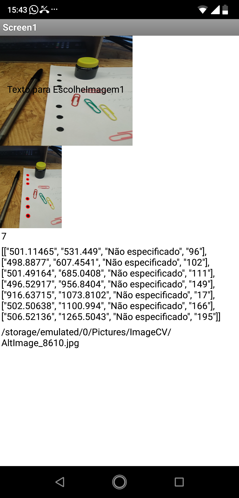 --->
 

Na tela do celular: 

- No alto a visualização da foto escolhida, 
- em seguida a foto processada com as sete elipses localizadas realçadas, 
- a quantidade de elipses localizadas;
- lista contendo uma sub-lista por elipse. Cada sub-lista contém as coordenadas de uma elipse, a expressão "Não especificado" (para uso futuro) e o tamanho da elipse;
- por último, o caminho para o arquivo processado.

[Imagem Original (Tamanho: 2,8M)](amostras/Elipses/IMG_20200615_165551868.jpg)

[Imagem Processada (Tamanho: 600k)](amostras/Elipses/AltImage_8610.jpg)

[Aplicativo para localizar elipses](Elipses.apk)

[Código-fonte do Aplicativo para localizar elipses](Elipses.aia)

#### Detecção de polígonos

O app foi codificado para identificar polígonos de quatro lados, por abuso de notação, usou-se retângulos para o nome do app. Abra o app `Retangulos` no celular e escolha uma foto.

<!--- 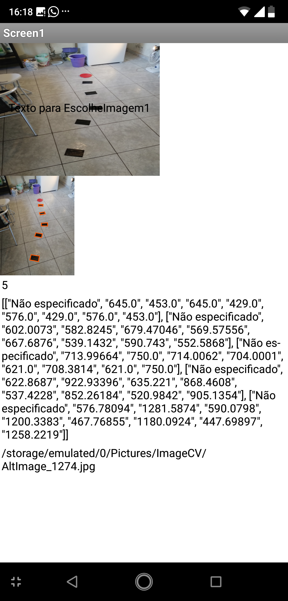 --->
 

Na tela do celular: 

- No alto a visualização da foto escolhida, 
- em seguida a foto processada com os cinco retângulos localizados realçados (clicando na foto ela é aberta em tela cheia), 
- a quantidade de retângulos localizados;
- lista contendo uma sub-lista por retângulo. Cada sub-lista descreve um retângulo, iniciando pela expressão "Não especificado" (para uso futuro) e as coordenadas de cada um dos vértices;
- por último, o caminho para o arquivo processado.

[Imagem Original (Tamanho: 3M)](amostras/Retangulos/IMG_20200615_152429437.jpg)

[Imagem Processada (Tamanho: 700k)](amostras/Retangulos/AltImage_1274.jpg)

[Aplicativo para localizar quadriláteros](Retangulos.apk)
[Código-fonte do Aplicativo para localizar quadriláteros](Retangulos.aia)

#### Identificação/Substituição de cor

Abra o app `Ola` no celular e escolha uma foto, ajuste os intervalos de H e S que deseja substituir por preto (Hmin, Hmax, Smin, Smax), clique no botão `Seleciona Cor`.

<!--- 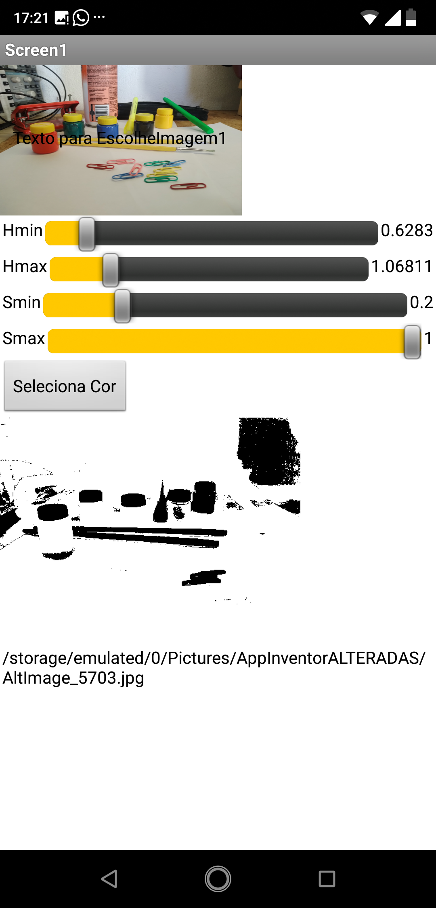 --->
 

Na tela do celular: 

- No alto a visualização da foto escolhida, 
- em seguida os quatro controles deslizantes através dos quais ajusta-se Hmin, Hmax, Smin e Smax.
- o botão `Seleciona Cor` - apertar depois de escolher os intervalos de H e S desejados,
- a foto processada, com as cores substituídas (clicando na foto ela é aberta em tela cheia), 
- por último, o caminho para o arquivo processado.

[Imagem Original (Tamanho: 2,7M)](amostras/Ola/IMG_20200615_132103299.jpg)

[Imagem Processada (Tamanho: 90k)](amostras/Ola/AltImage_5703.jpg)

No exemplo acima, com 0.6283 < H < 1.06811 e 0.2 < S < 1, selecionou-se muitas áreas com sombras. Para remover um pouco as sombras, pode-se aumentar um pouco a Saturação, o que pode ser interpretado como excluir áreas com pouca cor.

Resultado ajustando para  0.6283 < H < 1.06811 e **0.41** < S < 1

<!--- 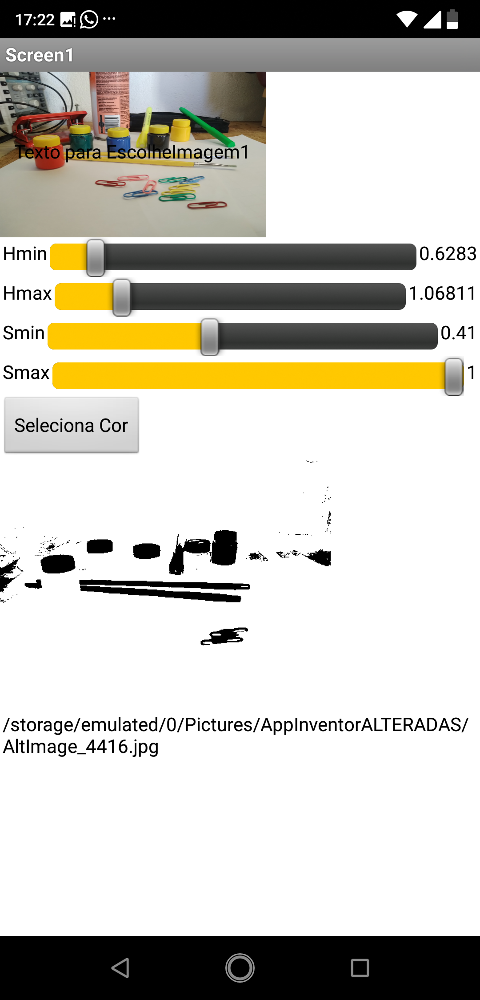 --->
 

Imagem Original (Tamanho: 2,7M) é a mesma do exemplo acima.

[Imagem Processada (Tamanho: 60k)](amostras/Elipses/Ola/AltImage_4416.jpg)

[Apĺicativo para binarizar cores a partir de foto de arquivo](Ola.apk)

[Código-fonte do Apĺicativo para binarizar cores a partir de foto de arquivo](Ola.aia)

Você pode estar se questionando [por que HSV ao invés de RGB](#Por-que-HSV-ao-invés-de-RGB). HSV é um sistema de codificação de cores que, comparado ao RGB, organiza o espaço de cores de uma forma mais intuitiva para nós, humanos.

#### Conversor de código RGB para HSV

Para explorar a conversão de RGB para HSV usada no ImageCV (fornecida no BoofCV), construi-se o app Conversor.

[Aplicativo para converter código RGB em código HSV](Conversor.apk)

[Código-fonte do Aplicativo para converter código RGB em código HSV](Conversor.aia)

É pertinente um aviso pois pode haver variação da cor em função da tela do aparelho - aparelhos diferentes podem apresentar cores ligeiramente diferentes. Também a visão de cada indivíduo é ligeiramente diferente - pessoas diferentes podem discordar sobre a cor de um mesmo objeto.

Sobre os sistemas

- RGB decompõe uma determinada cor em vermelho (R), verde (G) e azul (B) com intensidades inteiras variando de 0 a 255. Cada determinada cor é definida pela combinação das intensidades nos componentes.
- HSV decompõe uma determinada cor em matiz (Hue ou H), saturação (Saturation ou S) e valor (Value ou V). Matiz é codificado de 0 a 2*PI e representa uma variação contínua de cor:
Matiz próximo de zero corresponde a vermelho, Matiz próximo de 1 a amarelo, Matiz próximo de 4 a verde, próximo de 5 a azul, próximo de 6.28 a vermelho (novamente). Saturação é uma medida contínua de 0 a 1 que representa quantidade de cor. Valores próximos de 0 são menos intensos (ou menos definidos), valores próximos de 1 são mais intensos (ou mais definidos). Valor é uma medida de luminosidade - valores próximos a zero são menos luminosos (ou mais sombreados) e valores próximos a 255 são mais luminosos (ou menos sombreados, ou mais iluminados).

<!--- 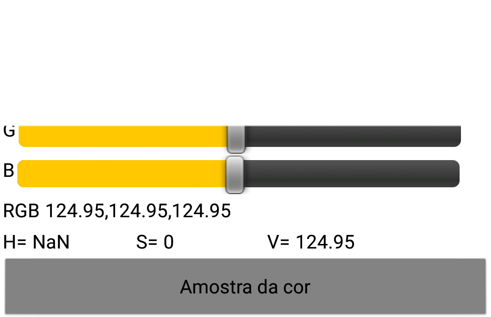 --->
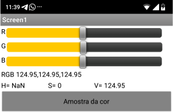 

Na tela do celular: 

- No alto três controles deslizantes, cada um correspondendo a vermelho (R), verde (G) e azul (B), que podem ser variados de 0 a 255;
- em seguida os valores RGB selecionados nos controles deslizantes;
- em seguita os valores HSV correspondentes aos valores RGB selecionados; 
- por último, uma amostra da cor (apresentada como cor de fundo do botão);

Quando o app é aberto os controles deslizantes são posicionados no meio. A cor resultante é um tom de cinza. Este ajuste causa uma divisão por zero na conta para H, por isso é mostrado NaN.

Por exemplo, deslizando R e G para o máximo e B para o mínimo, obtém-se um amarelo "puro" e intenso:

<!--- 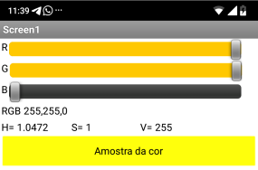 --->
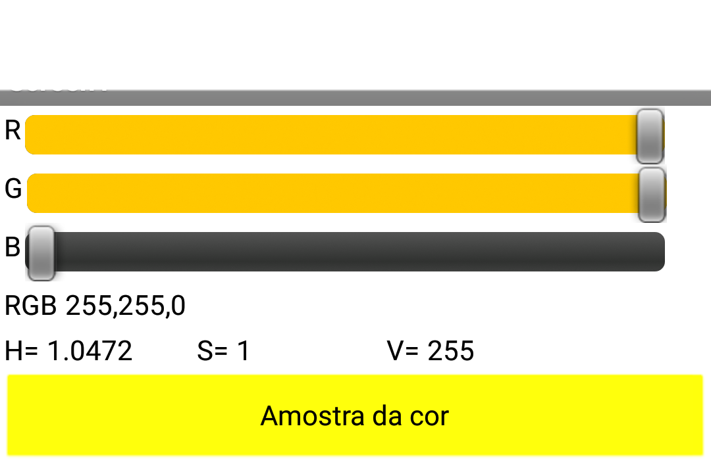 

O amarelo tem H em torno de 1 e este, em particular, tem alta saturação (ou é intenso).

A tela abaixo também apresenta um amarelo.

<!--- 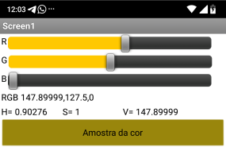 --->
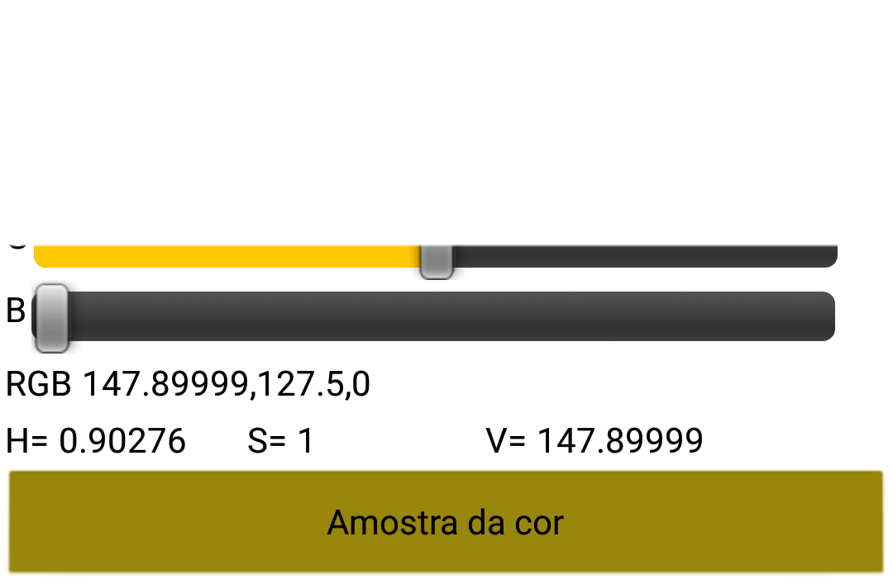 

#### Substituição de cor encadeada a detecção de elipses e retângulos.

Nestes exemplos a imagem é processada realçando uma cor específica e depois, sobre a imagem processada, as formas são localizadas.

**Realça o laranja e localiza a forma**

[Imagem Original (Tamanho: 2,7M)](amostras/Combinado/IMG_20200615_192802274.jpg)

<!--- 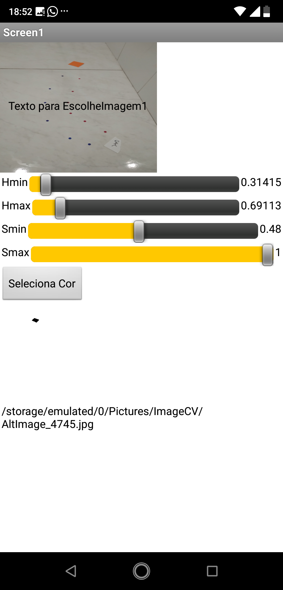 --->
 

[Imagem com o laranja realçado (12k)](amostras/Combinado/AltImage_4745.jpg)

<!--- 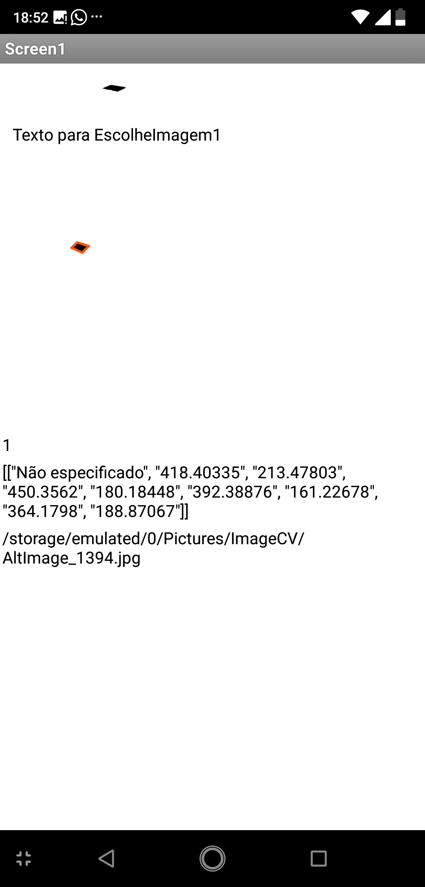 --->
 

[Imagem com o retângulo localizado (9k)](amostras/Combinado/AltImage_1394.jpg)

**Realça o azul e localiza as formas**

Imagem Original (Tamanho: 2,7M) é a mesma do exemplo acima.

<!--- 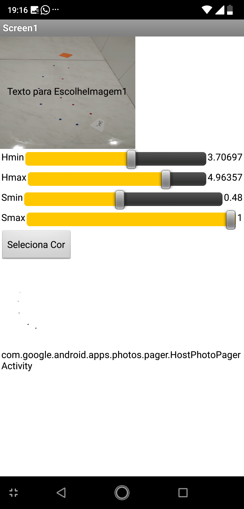 --->
 

[Imagem com o azul realçado (12k)](amostras/Combinado/AltImage_4339.jpg)

<!--- 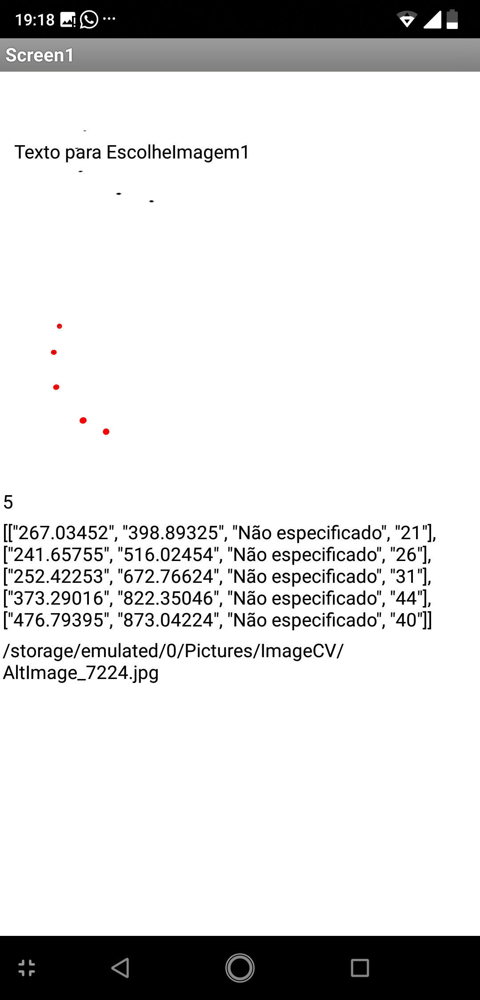 --->
 

[Imagem com as formas localizadas (10k)](amostras/Combinado/AltImage_7224.jpg)

**Realça o vermelho e localiza as formas**

Imagem Original (Tamanho: 2,7M) é a mesma do exemplo acima.

<!--- 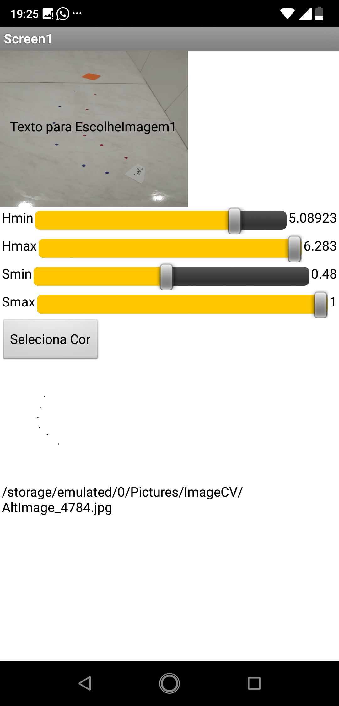 --->
 

[Imagem com o azul realçado (12k)](amostras/Combinado/AltImage_7538.jpg)

<!--- 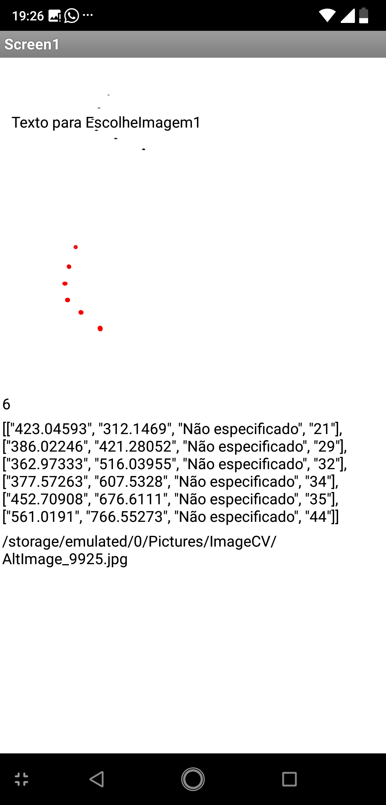 --->
 

[Imagem com as formas localizadas (10k)](amostras/Combinado/AltImage_9925.jpg)

## Como instalar a extensão

Baixe a extensão ImageCV [aqui](appcv.ImageCV.aix), guarde onde ela foi armazenada.

No seu projeto do App Inventor, no quadro da esquerda na aba extension clique no link *Import extension*

Uma caixa de mensagem se apresenta, clique em Browse, selecione o arquivo *appcv.ImagCV.aix* baixado no passo X.

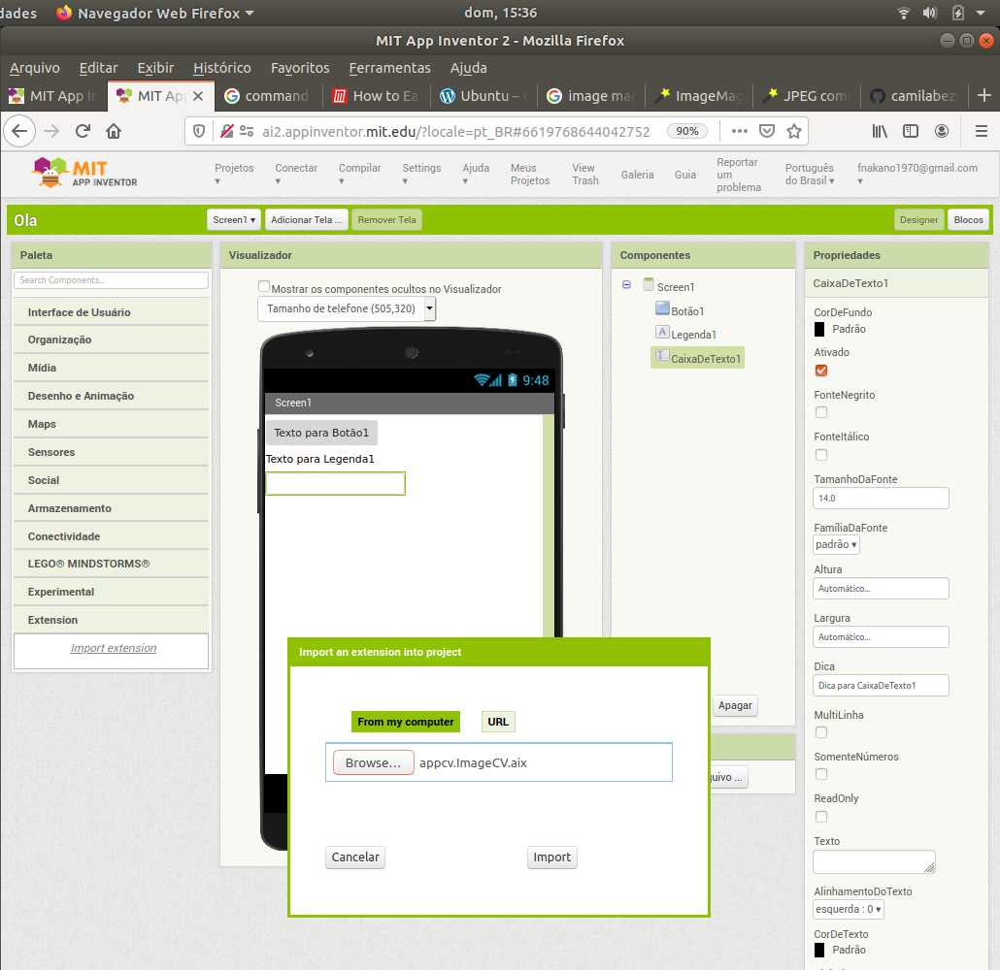

Deve aparecer na aba a extensão ImageCV.

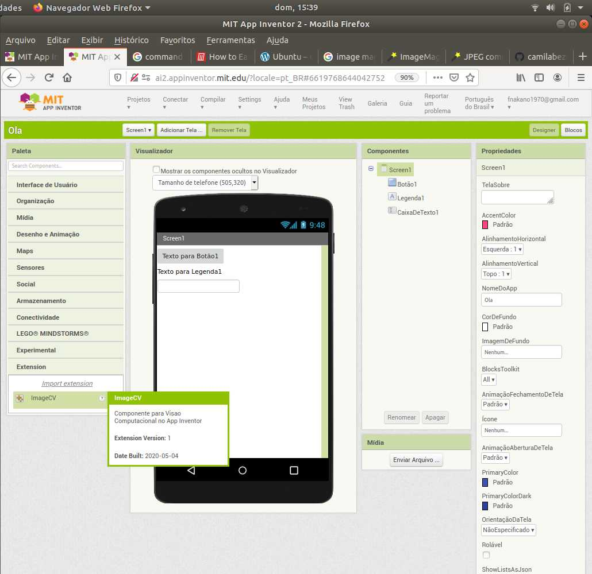

## Os aplicativos para teste

[Página para download de .aia e .apk](Testes/README.md)

## Referência dos blocos de ImageCV

### Por que HSV ao invés de RGB.

Em Visão Computacional, um componente que identifica uma determinada cor, recebe a informação sobre a cor a analisar e aplica uma fórmula. O resultado da aplicação da fórmula indica se a cor analisada é a determinada cor ou se a cor analisada não é a determinada cor.

Para manter o ImageCV simples para o programador que usa App Inventor e simples para desenvolvedores que forem aperfeiçoá-lo, os parâmetros passados para os blocos são números e não fórmulas. Acredite, construir boas fórmulas pode não ser fácil e o programador que usa App Inventor ficaria encarregado disso.

RGB e HSV são duas formas de codificar cores. No RGB, as cores são decompostas em componentes de cor, sendo estas as intensidades de vermelho (R), verde (G) e azul (B). No ImageCV, as intensidades de R, G e B vão de 0 a 255. Por exemplo:

**R** | **G** | **B** | Nome da cor
------|-------|-------|------------
0 | 0 | 0 | preto
255 | 255 | 255 | branco
255 | 0 | 0 | vermelho intenso
120 | 0 | 0 | vermelho médio
255 | 83 | 0 | laranja-avermelhado (ou vermelho-alaranjado?)
255 | 203 | 203 | um tom claro de rosa
255 | 0 | 255 | magenta
255 | 255 | 0 | amarelo
0 |200| 0 | um tom claro de verde

Seguindo a idéia de manter o ImageCV simples, na mais complexa das alternativas, permitiríamos valores mínimos e máximos de R, G e B. Desta forma, se o programador quisesse um vermelho, poderia usar algo como min={200,0,0} max={255, 20, 20}. Esta escolha deixaria de fora tanto os vermelhos mais escuros quanto os rosas mais claros, os vermelhos alaranjados, os vermelhos azulados,...

> O ponto é que usar RGB e colocar mínimo e máximo para definir cores leva a resultados corretos (dada a codificação), mas difíceis para pessoas entenderem, considerando a forma como percebem e categorizam cores.

Na codificação HSV, H coresponde à tonalidade, S à saturação e V a "claridade". H codifica tons: vermelhos, amarelos, verdes,... S codifica quão pigmentada é. Valores altos correspondem a cores intensas, vivas. V codifica se há pouca luz ou luz suficiente. Desta forma, o vermelho tem uma faixa de H, vermelhos pouco saturados (rosa) têm S baixos, vermelhos muito saturados (talvez como o nariz de um palhaço) têm S altos. V tem pouca influência na discriminação de cor.

A biblioteca usada em ImageCV para processamento de cores e formas é BoofCV. A explicação sobre HSV em BoofCV está em (http://boofcv.org/javadoc/boofcv/alg/color/ColorHsv.html)

(**nota** A [Wikipedia](https://en.wikipedia.org/wiki/HSL_and_HSV) explica com mais detalhes.)

(**nota**: os sensores das câmeras, em situações com muita luz, tendem a levar as cores para o branco. Diz-se que o sensor saturou, ou que as cores estão "estouradas". A codificação HSL parece lidar melhor com essa situação que a codificação HSV.)

### stepHSV

<!--- 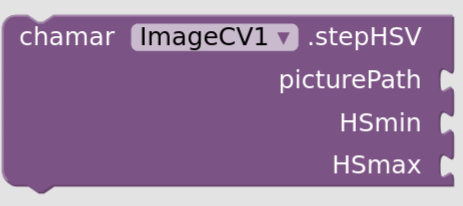 --->
 

picturePath: é um texto e representa a localização do arquivo de imagem sobre a qual aplicar o procedimento.
HSMin: é um texto contendo dois números separados por uma vírgula. Representam os valores mínimos de H e S.
HSMax:  é um texto contendo dois números separados por uma vírgula. Representam os valores máximos de H e S.

Retorna em altImagePath o texto indicando a localização do arquivo de imagem segmentado por cor.

baseado em (https://boofcv.org/index.php?title=Example_Color_Segmentation)

[Seção com o teste do bloco](Identificação/Substituição-de-cor)

### reconhecePoligonos

<!--- 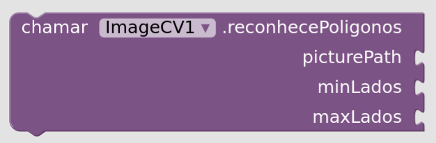 --->
 

picturePath: é um texto e representa a localização do arquivo de imagem sobre a qual aplicar o procedimento.
minLados: é um número que representa a quantidade mínima de lados dos polígonos a identificar (mínimo=3, máximo=20)
maxLados: é um número que representa a quantidade máxima de lados dos polígonos a identificar (mínimo=3, máximo=20)

O desempenho ótimo é conseguido quando os polígonos são pretos e planos em fundo branco, com iluminação uniforme, sem sombras.

Retorna em altImagePath o texto indicando a localização do arquivo de imagem com os polígonos identificados contornados em vermelho.

Retorna em nPoligonos a quantidade de polígonos encontrada.

Retorna em listaDePoligonos uma lista contendo nPoligonos sub-listas. Cada sub-lista contém a coordenadas dos vértices dos polígonos em ordem: [x1, y1, x2, y2, x3, y3, ..., xn, yn].

[Seção com o teste do bloco](#Detecção-de-polígonos)

### reconheceElipses

<!---  --->
 

picturePath: é um texto e representa a localização do arquivo de imagem sobre a qual aplicar o procedimento.

O desempenho ótimo é conseguido quando os polígonos são pretos e planos em fundo branco, com iluminação uniforme, sem sombras.

Retorna em altImagePath o texto indicando a localização do arquivo da imagem segmentada por cor.

Retorna em nElipses a quantidade de elipses encontrada.

Retorna em listaDeElipses uma lista contendo nElipses sub-listas. Uma sub-lista contém: [xcentro, ycentro, "Não Especificado", diâmetro_médio].

[Seção com o teste do bloco](#Detecção-de-elipses)

### converteRGBtoHSV

<!--- 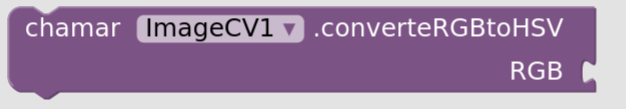 --->
 

RGB: é um texto contendo três números separados por vírgulas. Os números representam as intensidades de R, G, B, e vão de 0 a 255.

Após a conversão o valores resultantes são obtidos por 
[getHfromRGBtoHSV](#getHfromRGBtoHSV), 
[getSfromRGBtoHSV](#getSfromRGBtoHSV), 
[getVfromRGBtoHSV](#getVfromRGBtoHSV).

[Seção com o teste do bloco](#Conversor-de-código-RGB-para-HSV)

### getAltImagePath

<!--- 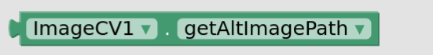 --->
 


Contém a localização do arquivo de imagem que contém as cores segmentadas ou as elipses ou os polígonos marcados, dependendo do método que foi utilizado.

<!--- 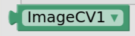 --->


### getListaDeElipses

<!--- 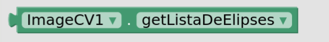 --->
 

Retorna uma lista contendo nElipses sub-listas. Cada sub-lista contém as coordenadas do centro, um texto (uso futuro) e o diâmetro médio de cada elipse: [xcentro, ycentro, "Não Especificado", diâmetro_médio].

### getListaDePoligonos

<!--- 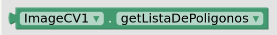 --->
 

Retorna uma lista contendo nPoligonos sub-listas. Cada sub-lista contém as coordenadas dos vértices de um polígono em ordem: [x1, y1, x2, y2, x3, y3, ..., xn, yn].

### getHfromRGBtoHSV

<!--- 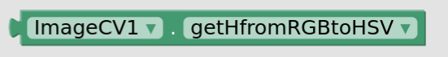 --->
 

Retorna um número de 0 a 2*PI (aprox. 6.28) que representa o matiz (Hue - H).

### getSfromRGBtoHSV

<!---  --->
 

Retorna um número de 0 a 1 que representa a saturação (Saturation - S).

### getVfromRGBtoHSV

<!--- 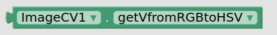 --->
 

Retorna um número de 0 a 255 que representa o valor (Value - V).

### getnElipses

<!--- 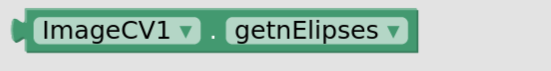 --->
 

Retorna um número que representa a quantidade de elipses.

### getnPoligonos

<!---  --->
 

Retorna um número que representa a quantidade de elipses.

### setnElipses

<!---  --->
 

Permite zerar a quantidade de elipses.

### setnPoligonos

<!---  --->
 

Permite zerar a quantidade de polígonos.

## Bibliografia

Pokress, S.C., Veiga, J. MIT App Inventor: Enabling Personal Mobile Computing. In Proceedings of the PRoMoTo Workshop at the ACM SIGPLAN conference on Systems, Programming, Languages and Applications (SPLASH ’13). ACM, New York, NY, USA. (http://arxiv.org/abs/1310.2830). 

Elsts, Atis & Judvaitis, Jānis & Selavo, Leo. (2013). SEAL: A Domain-Specific Language for Novice Wireless Sensor Network Programmers. Proceedings - 39th Euromicro Conference Series on Software Engineering and Advanced Applications, SEAA 2013. 220-227. 10.1109/SEAA.2013.16. 

[Mapa do site](sitemap.md)

```
@DesignerComponent(version = 1,
        category = ComponentCategory.EXTENSION,
        description = "Componente para Visao Computacional no App Inventor",
        nonVisible = true,
        iconName = "images/extension.png")

    @SimpleFunction(description = "Substitui os tons de uma cor por preto por meio do sistema HSV [FORMATO: 0-6.28, 0-1.0]")
    public void stepHSV(String picturePath, String HSmin, String HSmax){

    @SimpleFunction(description = "Converte RGB em HSV [FORMATO:x,x,x]")
    public void converteRGBtoHSV(String RGB) {

    @SimpleFunction(description = "Reconhece elipses em uma imagem")
    public void reconheceElipses(String picturePath){

    @SimpleFunction(description = "Reconhece polígonos em uma imagem, minLados >= 3 e maxLados <= 20")
    public void reconhecePoligonos(String picturePath, int minLados, int maxLados) {
```


(**nota**: [um pesquisador da UNICAMP propõe criar uma versão do App Inventor traduzida para português](https://appinventor.mit.edu/explore/blogs/josh/2016/01/mit-0)

(**nota**: a interface web tem suporte para Português do Brasil)

(**A falta de um tutorial em português pode ser barreira para seu uso com crianças brasileiras.**)

(https://cacm.acm.org/magazines/2019/8/238340-block-based-programming-in-computer-science-education/fulltext
https://en.scratch-wiki.info/wiki/Block-Based_Coding

)

(**nota**: para cortar as imagens e diminuir seu tamanho usei imageMagic, segundo https://itectec.com/ubuntu/ubuntu-cropping-images-using-command-line-tools-only/

```
fabio@fabio-13Z940-G-BK71P1:~/Documentos/Camila/screenshots-primeiroApp$ identify Captura\ de\ tela\ de\ 2020-06-14\ 08-47-54.png 
Captura de tela de 2020-06-14 08-47-54.png PNG 1080x1920 1080x1920+0+0 8-bit sRGB 1.974MB 0.000u 0:00.000
```
```
fabio@fabio-13Z940-G-BK71P1:~/Documentos/Camila/screenshots-primeiroApp$ convert Captura\ de\ tela\ de\ 2020-06-14\ 10-45-03.png -quality 50 -crop 1080x1000+50+0 17.jpg
```

)

